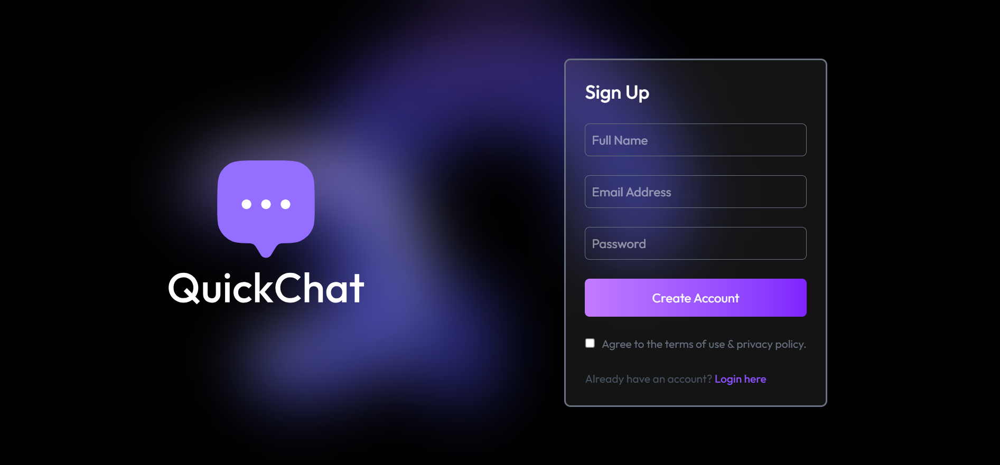
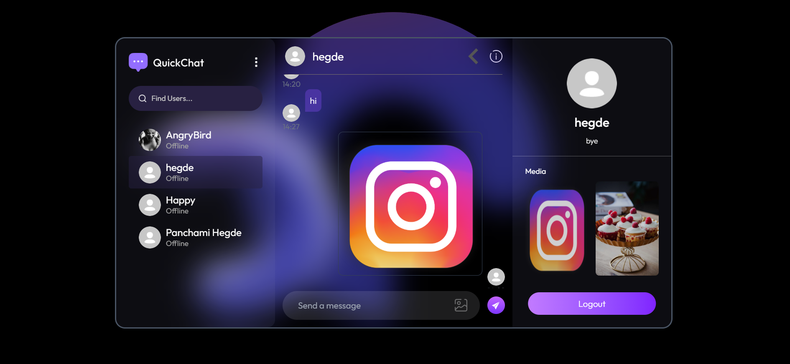

# Realtime Chat App

A full-stack **Realtime Chat Application** with modern UI/UX, secure authentication, and live messaging — powered by **React.js**, **Socket.IO**, **Express**, and **MongoDB**.

## Features

- **JWT Authentication**
  - Signup/Login with secure tokens
  - Persistent sessions with token stored in `localStorage`

- **User Management**
  - Update profile (name, profile pic)
  - View all users in sidebar (except yourself)

- **Online/Offline Presence**
  - Shows real-time online status using Socket.IO
  - Green dot for online users, grey for offline

- **One-to-One Messaging**
  - Realtime bi-directional messages via WebSocket
  - Seen/unseen message tracking
  - Auto-scroll to latest message

- **Unread Message Counter**
  - Badge shows count of unseen messages for each user
  - Count disappears once messages are opened

- **Clean UI/UX**
  - Responsive and accessible layout
  - Sidebar + chat window interface

---

## Tech Stack

| Frontend     | Backend        | Realtime & DB   |
|--------------|----------------|-----------------|
| React.js     | Node.js        | Socket.IO       |
| Axios        | Express.js     | MongoDB (Mongoose) |
| React Hooks  | JWT Auth       | WebSocket       |
| Tailwind CSS | REST APIs      |                 |

---

## How It Works

- On login:
  - A **JWT token** is issued and stored.
  - **Socket.IO client** connects with your user ID.
  - Other users see your status as **online**.

- On sending a message:
  - Message is sent via **Socket.IO** to the backend.
  - Receiver instantly gets the message in their chat.
  - If they’re on another chat, an **unread counter** is incremented.

- On switching to that chat:
  - Messages are fetched and marked as **seen** via REST API.

---

## Screenshots (optional)

Login Page

Chat Interface

---

## Future Improvements

- Group Chats
- Search Messages of a particular user
- Language translation

---

## Author

**Panchami Hegde** — [@Hegde1122](https://github.com/Hegde1122)  
**Role:** MERN Stack Developer  
Focus: Auth, state management, real-time message handling, UI/UX polish.

---

